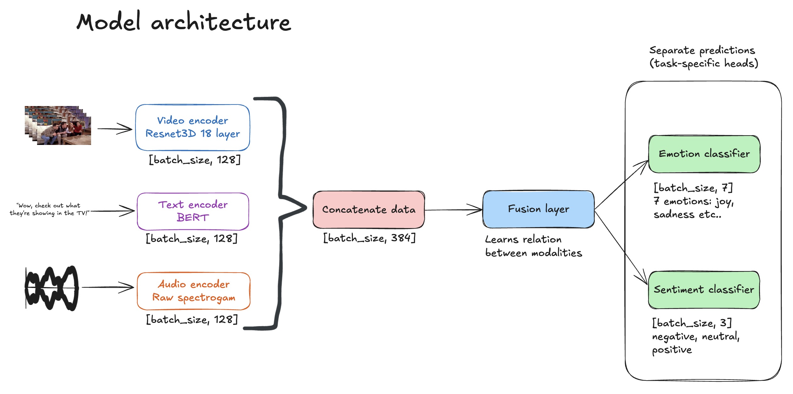

# 🎬 Multimodal Video Sentiment & Emotion Analysis  

This project demonstrates how to build and deploy a **multimodal AI model** that classifies sentiment and emotion from video clips by combining **text, audio, and video signals**.  
It also includes a **SaaS web application** where users can upload a video and see real-time predictions.  

The goal of this repository is twofold:
1. **Learning** → I built this project to understand the architecture and deployment of multimodal AI systems (PyTorch, AWS SageMaker, Next.js).  
2. **Sharing** → Making it beginner-friendly so others can learn how multimodal models work end-to-end.  

---

## 🚀 Project Architecture  

<p align="center">
  
</p>

- **Text** → transcripts tokenized with BERT  
- **Audio** → converted into mel spectrograms with torchaudio  
- **Video** → up to 30 resized frames per clip (224×224)  
- Encoders process each modality, then a **fusion layer** combines them for final prediction.  

---

## 🎥 Demo  

<p align="center">
  
</p>

---

## 📂 Repository Structure  
```bash
.
├── multimodal-model/         # Model training & deployment
│   ├── training/             # Dataset & training scripts
│   │   ├── meld_dataset.py   # MELD dataset preprocessing
│   │   ├── models.py         # Text/Audio/Video encoders & fusion model
│   │   ├── train.py          # Local training script
│   ├── deployment/
│   │   ├── deploy_endpoint.py # Deploy to SageMaker endpoint
│   │   ├── inference.py      # Run inference on new videos
│   │   ├── models.py         # Same encoders used for deployment
│   ├── train_sagemaker.py    # Launch training on AWS SageMaker
│
├── multimodal-saas/          # Next.js web application
│   ├── pages/                # Upload form & UI
│   ├── lib/                  # AWS S3 + SageMaker client
│   ├── components/           # React components
│   ├── package.json
│   └── …
│
└── README.md                 # You are here
```

---

## ⚙️ Installation & Setup  

### Model Training & Deployment (Python)  
```bash
# Create and activate a virtual environment
python3 -m venv .venv
source .venv/bin/activate

# Install dependencies
pip install -r requirements.txt
```

### SaaS Web App (Next.js)  
```bash
cd multimodal-saas
npm install

# To start the development server
npm run dev
```

### AWS Setup  
- Create an S3 bucket to store video uploads and model artifacts.  
- Create an IAM role with permissions for S3 and SageMaker access.  
- Create a `.env` file in `multimodal-saas/` with your AWS credentials, region, S3 bucket name, and SageMaker endpoint:  
```bash
AWS_ACCESS_KEY_ID=your-key
AWS_SECRET_ACCESS_KEY=your-secret
AWS_REGION=your-region
S3_BUCKET=your-bucket
SAGEMAKER_ENDPOINT=your-endpoint
```

---

## 🏋️ Training & Deployment

### Dataset
- We use the MELD (Multimodal EmotionLines Dataset).
  
👉 [MELD Dataset](https://affective-meld.github.io/)

### Local Training
```bash
python multimodal-model/training/train.py
```
### SageMaker Training
```bash
python multimodal-model/train_sagemaker.py
```
### Deploy to SageMaker Endpoint
```bash
python multimodal-model/deployment/deploy_endpoint.py
```

💡 Note:
If you want to skip the training process (which costs around $15 on AWS),
you can directly use the pre-trained normalized model weights — see the Results section below.

---

## 📊 Results  

### Normal vs Normalized Model  
The MELD dataset is **highly imbalanced**, with a large majority of samples labeled as **neutral** (both for sentiment and emotion).  
This makes it harder for a model trained “as is” to learn the minority classes (e.g., joy, sadness, anger).  

- **Normal Model** → trained directly on MELD without adjustments.  
  - The model tended to overfit to **neutral** predictions.  

- **Normalized Model** → applied class balancing and normalization techniques.  
  - Training and validation losses were more stable.  
  - Generalization improved across minority classes.  

Since training on AWS SageMaker costs about **$15 per run**, you can directly use the pre-trained **normalized model weights** here:  
👉 [Download Normalized Model Weights](https://huggingface.co/PBryen/video-sentiment-model)  

---

### Test Set Performance  
| Model              | Train Loss (final) | Val Loss (final) | Test Loss | Notes |
|--------------------|--------------------|------------------|-----------|-------|
| **Non-normalised** | ~2.05              | ~2.13            | **1.99**  | Best overall accuracy, but biased toward *neutral* class |
| **Normalised**     | ~2.61              | ~2.63            | **2.64**  | Slightly worse accuracy, but fairer across all emotion/sentiment classes |
---

Performance was consistent across training and validation, confirming that normalization helped reduce bias towards neutral classes.  

---

## 💻 Usage

### Run inference locally
```bash
python multimodal-model/deployment/inference.py --video sample.mp4
```
### Use SaaS Web App
1.	Start the Next.js app
```bash
cd multimodal-saas
npm run dev
```

2.	Upload a video via the UI
3.	Get predictions (sentiment + emotion)

---
## 🙏 Acknowledgments

This project is a personal learning reproduction of [Andreas Trolle’s YouTube tutorial](https://youtu.be/Myo5kizoSk0?si=DRLsjQxKAVwnW2dA).  
I followed and restructured the original implementation to understand the end-to-end pipeline, added detailed comments for clarity, optimized inference for CPU-only deployment to reduce costs, and fixed environment issues related to ffmpeg and SageMaker instance compatibility.

---